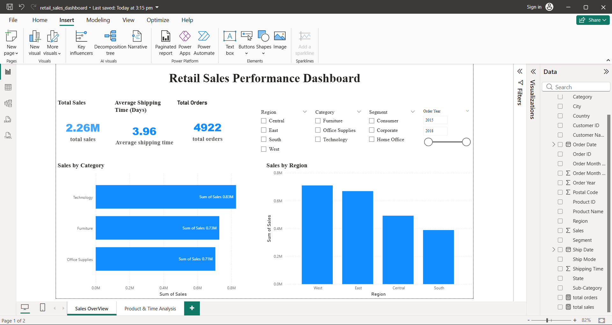
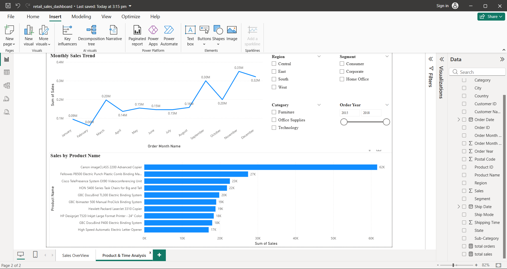

# Retail-Sales-Analysis
Retail sales analysis dashboard built using Excel and Power BI to uncover sales trends, regional performance, and top products.
# Retail Sales Analysis Dashboard

## Project Overview
This project analyzes retail sales data to uncover key business insights such as sales performance by category, regional performance, monthly trends, and top-selling products.

The dashboard was built using Excel for data cleaning and Power BI for data visualization.

## Tools Used
Excel – Data cleaning and preprocessing  
Power BI – Data visualization and dashboard creation

## Key Insights
• Technology generated the highest sales among all categories  
• The West region recorded the highest revenue  
• Sales showed seasonal spikes towards the end of the year  
• A small number of products contribute significantly to overall sales

## Dashboard Preview

### Sales Overview

### Product & Time Analysis

## Files Included
- train_Cleaned.xlsx
- retail_sales_dashboard.pbix
- sales_overview_dashboard.png
- product_analysis_dashboard.png
